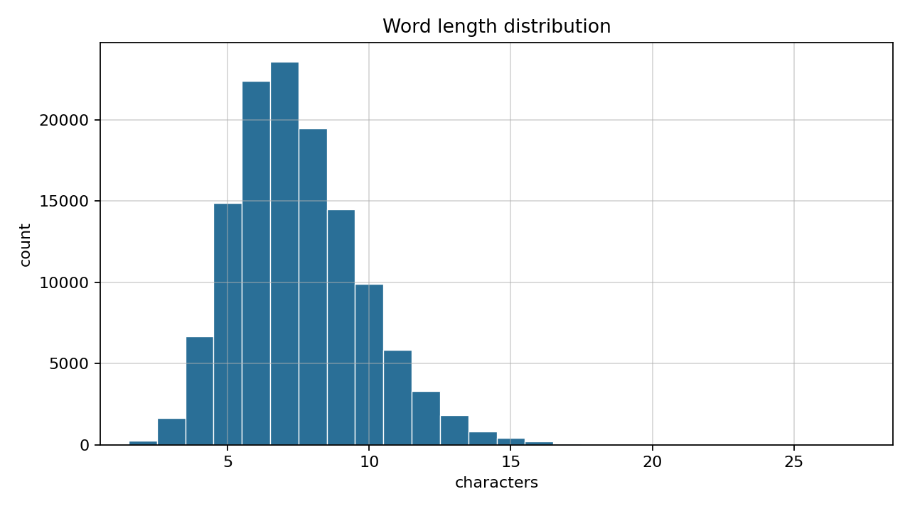
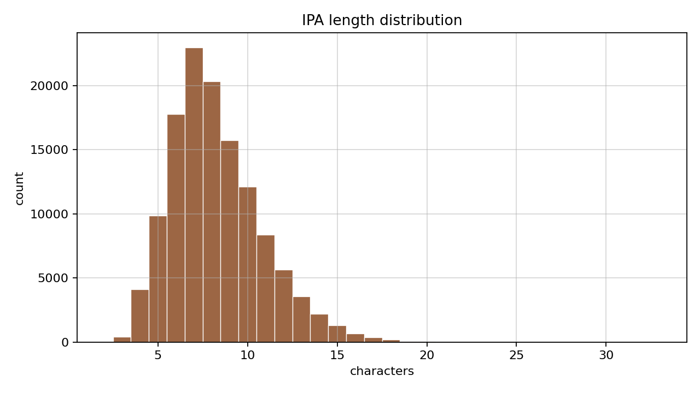

# IPA Transcriptor

## Overview

This project fine-tunes a Hugging Face seq2seq model for English word to IPA transcription. The base checkpoint is `google/byt5-small`, trained with `transformers.Seq2SeqTrainer` on the Kaggle dataset [English phonetic and syllable count dictionary](https://www.kaggle.com/datasets/schwartstack/english-phonetic-and-syllable-count-dictionary). The task format is:

```text
ipa: analytical  ->  ˌænəˈlɪtɪkəl
```

## Dataset

Source: [schwartstack/english-phonetic-and-syllable-count-dictionary](https://www.kaggle.com/datasets/schwartstack/english-phonetic-and-syllable-count-dictionary).

The raw Kaggle file `phoneticDictionary.csv` uses columns `word`, `phon`, `syl`, `start`, `end`. After renaming and cleaning we keep `word` and `phonetic`. Slashes and square brackets are stripped from IPA strings. Incomplete API artefacts such as `/-` and `?` are removed. Words are lowercased, null rows are dropped, and duplicates are removed by `word`.

The dictionary word list is larger, but only rows with a usable phonetic field are kept. The cleaned corpus has **125,925** word–IPA pairs.

Split `90/5/5` with seed `42`:

| Split | Rows |
| ----- | ---: |
| Train | 113,332 |
| Validation | 6,296 |
| Test | 6,297 |

### Length statistics in characters

Lengths are measured in Unicode characters after normalisation.

| Statistic | `word` | `phonetic` |
| --------- | -----: | ---------: |
| min | 1 | 1 |
| median | 7 | 8 |
| mean | 7.49 | 8.27 |
| p90 | 11 | 12 |
| p95 | 12 | 13 |
| p99 | 14 | 16 |
| max | 28 | 34 |

Most entries are short: the median orthographic length is 7 characters and the median IPA length is 8 characters. Long-tail entries stay below 35 characters in IPA, so word-level subword models are a poor fit and byte-level seq2seq is appropriate.





Regenerate plots and `docs/dataset_stats.json`:

```bash
export PYTHONPATH=.
python scripts/dataset_stats.py
```

Processed CSV files are written to `data/processed/`.

### Sequence limits

`max_source_length` and `max_target_length` are limits for the ByT5 tokenizer in **UTF-8 bytes**, not in the character counts from the table above. One IPA symbol is often 2–3 bytes. On the cleaned corpus the byte maxima are 33 for `ipa: {word}` and 53 for the IPA target, so the config uses 36 and 56 with a small margin.

## Model

Base model: [`google/byt5-small`](https://huggingface.co/google/byt5-small).

With median length 7–8 characters and max length 34 in IPA, a word-piece or sentence-level Transformer is mismatched to the task. ByT5 tokenises at the UTF-8 byte level, so each decoding step changes a small part of the transcript instead of emitting long multi-character chunks learned from natural-language pretraining.

Default configuration in `configs/default.yaml`:

- `model_name_or_path`: `google/byt5-small`
- `source_prefix`: `ipa: `
- `max_source_length`: 36
- `max_target_length`: 56

Training settings:

- GPU: NVIDIA L4, Colab Pro
- `per_device_train_batch_size`: 64
- `gradient_accumulation_steps`: 2
- epochs: 10
- learning rate: `5e-5`
- scheduler: warmup ratio `0.06`
- optimiser: AdamW via `Seq2SeqTrainer`
- mixed precision: `bf16` on CUDA when supported, never `fp16` with ByT5
- best checkpoint: lowest `eval_loss`

The fine-tuned weights are saved to `runs/<run_name>/best/` in Hugging Face format.

## Metrics

Teacher-forcing loss from `transformers`:

$$
\mathcal{L} = -\frac{1}{N}\sum_{i=1}^{N} \log p_\theta\bigl(y_i \mid y_{1:i-1}, x\bigr)
$$

Perplexity:

$$
\mathrm{PPL} = \exp(\mathcal{L})
$$

Exact match:

$$
\mathrm{EM} = \frac{1}{M}\sum_{j=1}^{M} \mathbb{I}(\hat{y}_j = y_j)
$$

Character error rate:

$$
\mathrm{CER} = \frac{\sum_j \mathrm{Levenshtein}(\hat{y}_j, y_j)}{\sum_j |y_j|}
$$

Decoding uses beam search with `num_beams=4`. Corpus BLEU is computed with SacreBLEU.

### Benchmark results

Fine-tuned `google/byt5-small` on NVIDIA L4, run `colab_l4_bf16`, beam search:

| Split | Loss | Perplexity | Exact match | CER | BLEU |
| ----- | ---: | ---------: | ----------: | --: | ---: |
| Validation | 0.151 | 1.164 | 0.598 | 0.107 | 59.8 |
| Test | 0.148 | 1.159 | 0.611 | 0.104 | 61.1 |

Full JSON: `docs/colab_l4_bf16_benchmark.json`.

## Installation

```bash
git clone https://github.com/pymlex/ipa-transcriptor-300M.git
cd ipa-transcriptor-300M
python -m venv .venv
source .venv/bin/activate
pip install -U pip
pip install -r requirements.txt
cp .env.example .env
```

Required keys in `.env`:

- `KAGGLE_USERNAME`
- `KAGGLE_KEY`
- `HF_TOKEN`
- `HF_REPO_ID` default `pymlex/ipa-transcriptor-300M` for model weights on the Hub

## Data download and preparation

```bash
export PYTHONPATH=.
python main.py download --raw-dir data/raw
python main.py prepare --raw-dir data/raw
```

Shell wrappers:

```bash
bash scripts/download.sh
bash scripts/prepare.sh
```

## Training

```bash
export PYTHONPATH=.
python main.py train --run-name l4_run1
```

Or:

```bash
RUN_NAME=l4_run1 bash scripts/train.sh
```

Per-run artefacts under `runs/<run_name>/`:

- `metrics.jsonl`
- `metrics.csv`
- `run_meta.json`
- `benchmark.json`
- `best/` Hugging Face checkpoint

Intermediate `checkpoint-*` folders are also stored under the same run directory by `Seq2SeqTrainer`.

## Evaluation

```bash
export PYTHONPATH=.
python main.py evaluate \
  --checkpoint runs/l4_run1/best \
  --output runs/l4_run1/benchmark_manual.json
```

Or:

```bash
CHECKPOINT=runs/l4_run1/best \
OUTPUT=runs/l4_run1/benchmark_manual.json \
bash scripts/evaluate.sh
```

## Inference

```bash
export PYTHONPATH=.
python scripts/inference.py \
  --model-dir runs/l4_run1/best \
  --word analytical
```

```python
from transformers import AutoModelForSeq2SeqLM, AutoTokenizer
import torch

model_id = "pymlex/ipa-transcriptor-300M"
source_prefix = "ipa: "

tokenizer = AutoTokenizer.from_pretrained(model_id)
model = AutoModelForSeq2SeqLM.from_pretrained(model_id)
model.eval()
device = torch.device("cuda" if torch.cuda.is_available() else "cpu")
model.to(device)

def transcribe(word: str, num_beams: int = 4) -> str:
    source = f"{source_prefix}{word.strip().lower()}"
    encoded = tokenizer(source, return_tensors="pt", truncation=True, max_length=32).to(device)
    output_ids = model.generate(**encoded, max_new_tokens=64, num_beams=num_beams, early_stopping=True)
    return tokenizer.decode(output_ids[0], skip_special_tokens=True)

print(transcribe("analytical"))
```

## Push to Hugging Face

```bash
export PYTHONPATH=.
export CHECKPOINT=runs/l4_run1/best
export HF_REPO_ID=pymlex/ipa-transcriptor-300M
python main.py push --checkpoint "$CHECKPOINT"
```

The script uploads tokenizer and model with `push_to_hub` to `pymlex/ipa-transcriptor-300M`.

```bash
CHECKPOINT=runs/l4_run1/best bash scripts/push_hf.sh
```

## Colab workflow

Open `notebooks/colab.ipynb`. The notebook calls shell scripts for clone, install, download, prepare, train, evaluate, Hub upload, and git push.

## Project layout

```text
ipa-transcriptor-300M/
├── configs/default.yaml
├── data/prepare.py
├── data/hf_dataset.py
├── training/train.py
├── evaluation/metrics.py
├── evaluation/benchmark.py
├── scripts/
├── notebooks/colab.ipynb
├── main.py
├── schemas.py
└── utils/
```

## Licence

GPL-3.0. See `LICENSE`.
